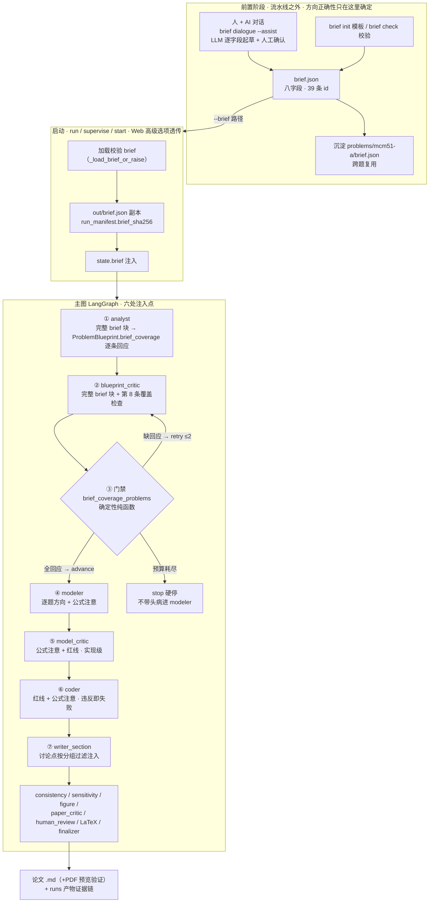

<!-- doc: type=contract status=superseded updated=2026-08-27 -->
> **superseded（2026-08-27 文档收口）**：全流程总图角色已被 [8-27-操作面契约](实现计划-8-20/8-27-操作面契约.md)（内流程 S0–S9）+ [内外全流程总纲](内外全流程总纲.md)（端到端）取代；内部 LangGraph 注入描述降为工具层参考。当前行为依据以上述两文件为准。本文保留作历史设计参考。

# Modeling Brief 全流程总图（前置对话 → 注入 → 门禁 → 主图）

- 建立日期：2026-08-19
- 关联：[验证与下一步](12-ModelingBrief验证与下一步.md)、[实施计划书](10-ModelingBrief实施计划书.md)、[MCM-51 迭代计划](08-MCM51整改迭代计划.md)
- 定位：**流程图 + 各环节验证状态标注**。回答"整个流程到底长什么样、哪一步有证据、哪一步还没有"。
- 状态图例：`✅ 已验证`（单测/CLI 实测）｜`⚠️ 部分验证`（mock 级/已走通但未落盘）｜`🔴 未验证`（无 runs 产物）

---

## 一、总图（ASCII）

```
┌─ 前置阶段（流水线之外 · 方向正确性只在这里确定）──────────────────────────────┐
│                                                                            │
│   人 + AI 对话（brief dialogue --assist）        brief init / brief check   │
│   LLM 逐字段起草 ⚠️(2026-08-19 八字段草稿已走通，   （模板 / schema 校验 ✅） │
│   reference_direction 格式 bug 已修)              │                        │
│            │                                      │                        │
│            ▼                                      ▼                        │
│        brief.json（八字段 · 39 条 id ✅ brief check [OK]）                  │
│            │                                                              │
│            ▼ 沉淀跨题复用                                                   │
│   problems/mcm51-a/brief.json（人工整理 · 官方标准 + 数值量化）          │
└────────────┬───────────────────────────────────────────────────────────────┘
             │ --brief <path>（run / supervise / start · Web 高级选项透传）
             ▼
┌─ 启动阶段 ──────────────────────────────────────────────────────────────────┐
│   加载校验 brief（_load_brief_or_raise）                                    │
│   落盘 out/brief.json 副本 + run_manifest.brief_sha256  🔴 无 runs 产物     │
│   state.brief 注入                                                          │
└────────────┬────────────────────────────────────────────────────────────────┘
             ▼
┌─ 主图（LangGraph · 六处注入点，全部 ✅ 单测 mock 级）─────────────────────────┐
│                                                                            │
│   ① analyst ───────── 完整 brief 块                                        │
│      → ProblemBlueprint.brief_coverage（逐条回应 39 条）                    │
│            │                                                               │
│   ② blueprint_critic ─ 完整 brief 块 + 第 8 条覆盖检查                     │
│            │                                                               │
│   ③ 门禁 brief_coverage_problems（确定性纯函数 ✅ 单测）                     │
│      ├─ 全 39 条 followed / deviated+理由 → advance                         │
│      ├─ 缺回应 → retry（≤2 次）→ 仍缺 → stop 硬停（不带头病进 modeler）       │
│      └─ 无 brief → 恒通过（向后兼容）                                       │
│            │                                                               │
│   ④ modeler ──────── 逐题方向 + 公式注意（render_modeler_brief）            │
│   ⑤ model_critic ─── 公式注意 + 红线（实现级评审基准，不评方向本身）          │
│   ⑥ coder ────────── 红线 + 公式注意（违反即失败）                          │
│   ⑦ writer_section ─ 讨论点按分组过滤注入（required_discussions）           │
│            │                                                               │
│            ▼                                                               │
│   后续：consistency / sensitivity / figure / paper_critic /                │
│   human_review / LaTeX / finalizer → 论文 .md（+PDF 预览验证）+ runs 证据链  │
└────────────────────────────────────────────────────────────────────────────┘
```

## 二、Mermaid 版本（GitHub 可渲染）



## 三、各环节验证状态一览

| 环节 | 状态 | 证据 |
|---|---|---|
| 前置对话（人 + AI 起草） | ⚠️ 能力可用 | 2026-08-19 首次走通：八字段草稿全部生成（deepseek-v4-pro）；`reference_direction` 格式 bug 已修（草稿清洗 + 4 个新单测）；**尚无完整落盘的对话产物** |
| brief.json 39 条 | ✅ 合法 | `brief check [OK]`；来源 = 官方标准 + 人工整理（带数值量化），与对话草稿方向互相印证 |
| 注入六处 prompt | ✅ 接线已测 | `test_brief.py` 参数化：有 brief 含块 / 无 brief 不含块 |
| coverage 门禁 | ✅ 逻辑已测 | retry / 预算耗尽 stop / 全回应放行 / 无 brief 恒过 |
| out/brief.json + brief_sha256 | 🔴 无 runs 产物 | 需 `runs/51mcm-a-brief-v1` 真跑 |
| 传递完整性（39 条 coverage） | 🔴 无 runs 产物 | 需真跑后由 `scripts/sample_brief_direction.py` 提取 |
| 方向落地（1.2/2.2/3.1/4 代码+论文） | 🔴 无 runs 产物 | r11 基线抽样：1.2 自认未实现、2.2/3.1 无命中、红线 0.8·T_max 代码真实存在 |

## 四、当前可走路径（2026-08-19）

- **直接跑 MCM-51**：`--brief problems/mcm51-a/brief.json`（现有 39 条版本，不依赖对话产物）；
  对话产物另存为 `brief-from-dialogue.json` 作对比，跑通后 `brief check` 校验。
- 对话产物的定位：**能力证据 + 人工兜底**，不是本轮 run 的注入版本；
  未来"更直接的接口"（Web 对话 UI / 评分标准结构化注入 reference_material）落地后，
  需保证量化数值（T_c 区间、233%、e_cr≈3.66 等）能进入对话上下文，否则对话版会丢 40 分空白项的得分点。
