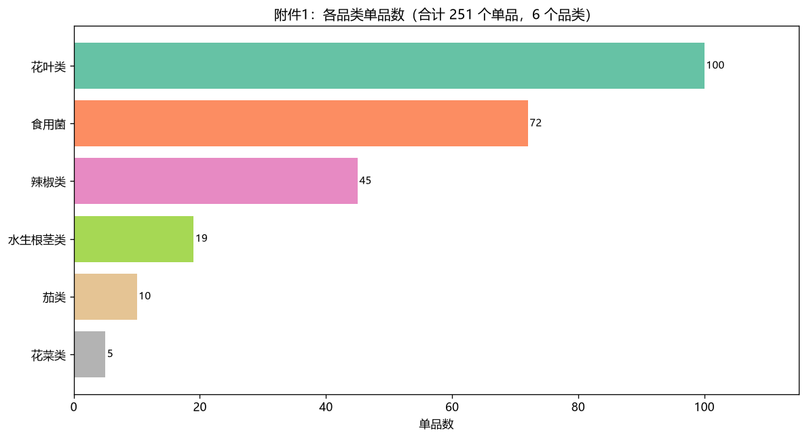
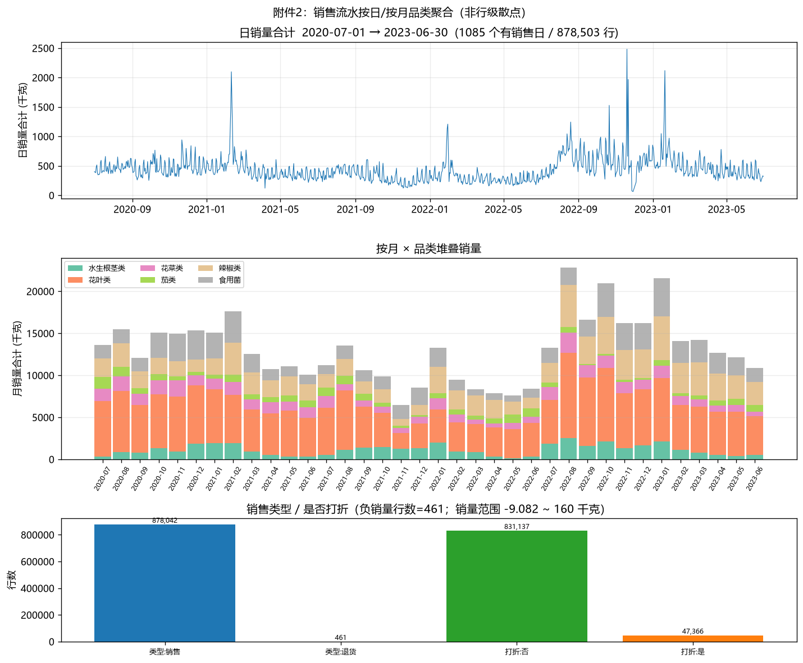
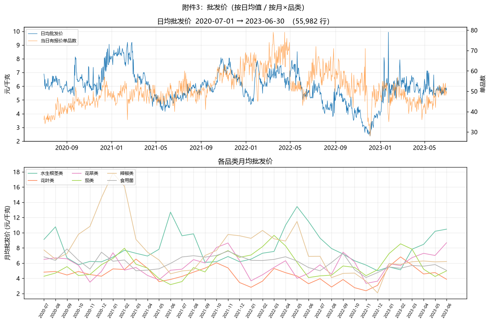
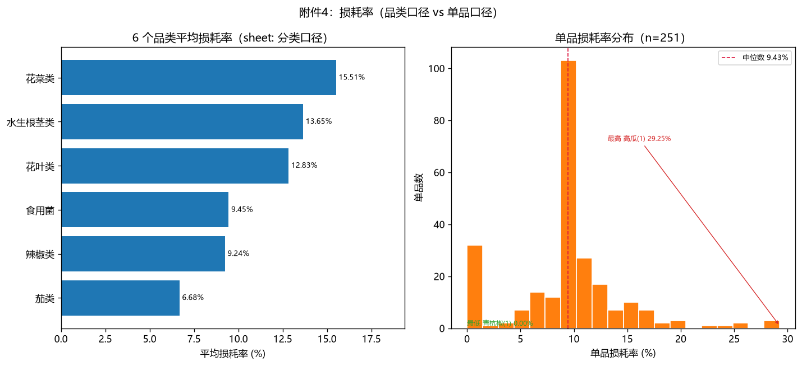

# 2023 年 CUMCM C 题（蔬菜自动定价与补货）数据画像

> 数据来源：`problems/cumcm23-c/source/` 下 4 个 xlsx（只读，未改源文件）。
> 读取：`E:\git_clone\Beacon\.venv\Scripts\python.exe` + pandas 3.0.3 + openpyxl 3.1.5（只读流）。
> 附件2（39,150,980 字节）用 `openpyxl.load_workbook(..., read_only=True, data_only=True)` **逐行扫描一次**，只保留按日/按月聚合，未把整表载入内存再复制。
> **声明：下文所有数字均来自这次真实读取**（见 `eda/_make_overview.py` 与 `eda/_profile_stats.json`），不是题面抄录，也未对照任何优秀论文/参考答案。

## 0. 总体速览

| 附件 | sheet | 数据行 × 列 | 时间范围 | 要点 |
|---|---|---|---|---|
| 附件1 商品信息 | `Sheet1` | **251 × 4** | 无时间列 | **6 个品类**、251 个单品编码（无重复） |
| 附件2 销售流水 | `Sheet1` | **878,503 × 7** | **2020-07-01 → 2023-06-30**（1,085 个有销售日） | 含 **退货 461 行**（销量全为负） |
| 附件3 批发价 | `Sheet1` | **55,982 × 3** | **2020-07-01 → 2023-06-30**（1,091 个有报价日） | `(日期, 单品编码)` 无重复；覆盖全部已售 `(日,SKU)` |
| 附件4 损耗率 | 两个 sheet | 品类 **6 × 3**；单品 **251 × 3** | 无时间列（题面称「近期盘点」） | 品类口径 ≠ 单品简单均值；85 单品损耗率恰好 9.43% |

日历跨度 2020-07-01～2023-06-30 共 **1,095 天**。流水缺 10 天、批发价缺 4 天。

### 0.1 概览图

由 `eda/_make_overview.py` 从 `source/` 一次性生成（中文字体 Microsoft YaHei）。路径相对 `problems/cumcm23-c/`。

| 附件 | 概览图路径 |
|---|---|
| 附件1 | `eda/附件1.png` |
| 附件2 | `eda/附件2.png` |
| 附件3 | `eda/附件3.png` |
| 附件4 | `eda/附件4.png` |

**附件1**（6 品类单品数：花叶类 100、食用菌 72、辣椒类 45、水生根茎类 19、茄类 10、花菜类 5）：

**附件2**（日销量合计 + 月×品类堆叠；销售/退货与是否打折行数；**不是** 87 万点散点）：

**附件3**（日均批发价与当日有报价单品数；各品类月均批发价）：

**附件4**（6 品类平均损耗率 vs 251 单品损耗率直方图）：

---

## 1. 附件1：商品信息（`附件1.xlsx`，17,803 字节）

### 1.1 结构

- 单 sheet **`Sheet1`**，**251 行 × 4 列**，无空行。
- 列名原文：`单品编码`、`单品名称`、`分类编码`、`分类名称`。
- 缺失：4 列全 **0**。
- `单品编码` 唯一 251、无重复；`单品名称` 也 251 唯一。

前 3 行：

| 单品编码 | 单品名称 | 分类编码 | 分类名称 |
|---|---|---|---|
| 102900005115168 | 牛首生菜 | 1011010101 | 花叶类 |
| 102900005115199 | 四川红香椿 | 1011010101 | 花叶类 |
| 102900005115625 | 本地小毛白菜 | 1011010101 | 花叶类 |

末行：`106973990980123 | 和丰阳光海鲜菇(包) | 1011010801 | 食用菌`。

### 1.2 品类锚点

| 分类编码 | 分类名称 | 单品数 |
|---|---|---:|
| 1011010101 | 花叶类 | 100 |
| 1011010801 | 食用菌 | 72 |
| 1011010504 | 辣椒类 | 45 |
| 1011010402 | 水生根茎类 | 19 |
| 1011010501 | 茄类 | 10 |
| 1011010201 | 花菜类 | 5 |

量纲猜测：编码为类别/SKU 主键（文本外观的数字串，未当数值运算）；名称为中文商品名。题面注：名称中的数字编号表示不同供应来源——数据里确实出现 `西峡花菇(1)`、`芜湖青椒(2)`、`虫草花(盒)(1)` 这类后缀。

### 1.3 喂给对撞的问题

- 品类是不是就是这 **6** 个小分类？有没有隐藏的「大类」？
- 251 是目录规模还是可售规模？流水里实际出现的单品是不是更少？

---

## 2. 附件2：销售流水（`附件2.xlsx`，39,150,980 字节）

### 2.1 结构

- 单 sheet **`Sheet1`**。openpyxl `max_row=878504` = 1 行表头 + **878,503 条数据**；扫描时空行 **0**。
- 列名原文：`销售日期`、`扫码销售时间`、`单品编码`、`销量(千克)`、`销售单价(元/千克)`、`销售类型`、`是否打折销售`。
- 缺失：7 列在 878,503 行上 **全部非空**（`missing` 计数为空字典）。

首行：`2020-07-01 00:00:00 | 09:15:07.924 | 102900005117056 | 0.396 | 7.6 | 销售 | 否`。

末行：`2023-06-30 00:00:00 | 21:40:48.248 | 102900011022764 | 0.803 | 12 | 销售 | 否`。

### 2.2 时间

- `销售日期` 范围 **2020-07-01 → 2023-06-30**，有销售日 **1,085 / 1,095**（缺 10 个日历日）。
- `扫码销售时间` 是带毫秒的日内时刻字符串（如 `09:15:07.924`），**不是** 日期；与批发价对齐应忽略该列、只用销售日期。

### 2.3 量纲与取值（流式累计）

| 量 | 读数 |
|---|---|
| 销量(千克) min / max | **−9.082** / **160.0** |
| 销量合计（含退货负值，净千克） | **470,975.918** |
| 销售单价(元/千克) min / max | **0.1** / **119.9** |
| 行额合计 Σ(销量×单价) | **3,369,766.48** 元（净额，退货为负贡献） |
| 销量为 0 的行 | **0** |
| 销量为负的行 | **461**（与退货行数相同） |

量纲：列名已写明千克、元/千克。单价 0.1 元/千克偏低、119.9 偏高，但是表内真实极值，不是缺失标记。

### 2.4 销售类型 / 打折 / 单品覆盖

| 项 | 行数 | 占比 |
|---|---:|---:|
| 销售类型=`销售` | 878,042 | 99.9475% |
| 销售类型=`退货` | **461** | **0.0525%** |
| 是否打折=`否` | 831,137 | 94.608% |
| 是否打折=`是` | 47,366 | 5.392% |

- **流水含退货**。负销量行数 = 退货行数 = 461，形态是「类型=退货 且 销量为负」，不是另写正千克。
- 流水中出现的单品编码 **246** 个，**全部** 能在附件1 找到；目录 251 里有 **5 个三年从未出现在流水**：

| 单品编码 | 单品名称 | 分类名称 |
|---|---|---|
| 102900005116776 | 本地菠菜 | 花叶类 |
| 102900005116042 | 藕 | 水生根茎类 |
| 102900011023648 | 芜湖青椒(2) | 辣椒类 |
| 102900011032145 | 芜湖青椒(份) | 辣椒类 |
| 102900011011782 | 虫草花(盒)(1) | 食用菌 |

### 2.5 品类销量（净千克，按附件1 分类映射后按月加总）

| 品类 | 三年净销量 (kg) |
|---|---:|
| 花叶类 | 198,520.978 |
| 辣椒类 | 91,588.629 |
| 食用菌 | 76,086.725 |
| 花菜类 | 41,766.451 |
| 水生根茎类 | 40,581.353 |
| 茄类 | 22,431.782 |

日销量时序在 2022-07 之后波动和峰值明显抬升（见 `eda/附件2.png` 上方面板），对撞时不要把 2020–2021 的日均直接当 2023-07 的需求先验。

有销售的 `(销售日期, 单品编码)` 唯一对 **46,599** 个。

### 2.6 喂给对撞的问题

- 退货 461 行要不要从需求里剔除、还是只在收益里当负销量？
- 打折 5.4% 行是「品相变差后的打折销售」还是促销？列里只有是/否，没有折扣率。
- 5 个目录单品从未售出：补货决策要不要当成可售？

---

## 3. 附件3：批发价格（`附件3.xlsx`，1,150,765 字节）

### 3.1 结构

- 单 sheet **`Sheet1`**，**55,982 行 × 3 列**。
- 列名原文：`日期`、`单品编码`、`批发价格(元/千克)`。
- 缺失：3 列全 **0**。
- `(日期, 单品编码)` 重复行 **0** → 每个单品每个有报价日最多一行。

前 3 行：`2020-07-01 | 102900005115762 | 3.88`；`…779 | 6.72`；`…786 | 3.19`。

末 3 行：`2023-06-30 | 102900051010455 | 4.48`；`106949711300259 | 1.45`；`106971533450003 | 1.95`。

### 3.2 时间与量纲

- 日期 **2020-07-01 → 2023-06-30**，有报价日 **1,091 / 1,095**（缺 4 个日历日）。
- 单品编码唯一值 **251**（与附件1 目录完全同集，含上述 5 个从未售出的 SKU）。
- 批发价格 min **0.01**、max **141.0**、mean **5.963**、median **4.63**；≤0 的行 **0**。
- 量纲：列名已写明元/千克。0.01 是真实下限（不是空值占位）。

### 3.3 与流水如何对齐（关键锚点）

对齐键：**附件2.`销售日期`.date + `单品编码` = 附件3.`日期`.date + `单品编码`**。日内扫码时间不参与。

| 对齐计数 | 值 |
|---|---:|
| 流水唯一 `(日,SKU)` | 46,599 |
| 其中能在批发价表命中 | **46,599（100%）** |
| 流水有销售但当天无批发价 | **0** |
| 批发价表 `(日,SKU)` | 55,982 |
| 其中当天该 SKU 无流水 | **9,383** |

结论（本读取）：**所有实际售出的 (日, 单品) 都能接到当天批发价**；批发价表更宽，包含未售出的报价日/SKU（含从未进入流水的 5 个目录单品）。不能用流水行去对齐「时刻」，只能对齐到「当天」。

当日有报价单品数大约 35–75（见 `eda/附件3.png`），远小于 251——大多数单品并非每天都有批发价，只是「有销售的那天一定有价」。

### 3.4 喂给对撞的问题

- 成本加成的「成本」是当天批发价，还是进货日前一天、还是周均？
- 9,383 条有批发价无销售：是备货未卖出，还是报价但未上架？
- 辣椒类 2021-01 月均批发价出现约 17 元/千克的尖峰，是数据还是季节？

---

## 4. 附件4：损耗率（`附件4.xlsx`，18,678 字节）

### 4.1 两个 sheet（口径不同）

**Sheet A** 名原文：`平均损耗率(%)_小分类编码_不同值`（6 行 × 3 列）。

列名原文：`小分类编码`、`小分类名称`、`平均损耗率(%)_小分类编码_不同值`。缺失 0。

| 小分类编码 | 小分类名称 | 平均损耗率(%) |
|---|---|---:|
| 1011010201 | 花菜类 | **15.51** |
| 1011010402 | 水生根茎类 | **13.65** |
| 1011010101 | 花叶类 | **12.83** |
| 1011010801 | 食用菌 | **9.45** |
| 1011010504 | 辣椒类 | **9.24** |
| 1011010501 | 茄类 | **6.68** |

**Sheet B** 名原文：`Sheet1`（251 行 × 3 列）。

列名原文：`单品编码`、`单品名称`、`损耗率(%)`。缺失 0。

- 与附件1：**251 个编码集合相同，名称也全部相同**。
- 单品损耗率 min **0.0**、max **29.25**、mean **9.427**、median **9.43**。
- **=0 的单品 22 个**；>100 的 0 个；负值 0 个。
- 锚点样例：`牛首生菜 4.39%`；`四川红香椿 10.46%`；`西峡花菇(1) 10.80%`；最低 `青杭椒(1) 0.0%`；最高 `高瓜(1) 29.25%`；末行 `和丰阳光海鲜菇(包) 0.12%`。

量纲：列名是 **百分比**（15.51 表示 15.51%，不是 0.1551）。题面说这是「近期盘点周期」算出的损耗，表内 **没有盘点起止日**。

### 4.2 两种口径对不上（不要当同一列用）

把 Sheet1 单品损耗率按附件1 品类做 **简单算术平均**，与品类 sheet 对比：

| 品类 | 单品数 | 单品损耗率均值 | 品类 sheet |
|---|---:|---:|---:|
| 花菜类 | 5 | 14.14 | **15.51** |
| 水生根茎类 | 19 | 11.97 | **13.65** |
| 花叶类 | 100 | 10.28 | **12.83** |
| 食用菌 | 72 | 8.13 | **9.45** |
| 辣椒类 | 45 | 8.52 | **9.24** |
| 茄类 | 10 | 7.12 | **6.68**（品类 sheet 反而更低） |

另外：251 个单品里 **85 个损耗率恰好为 9.43%**（也是全表中位数），直方图在 8–10% 形成尖峰。更像填值/默认档，不像 85 个独立盘点刚好相同。

### 4.3 喂给对撞的问题

- Q2 按品类补货该用 6 行「小分类平均」，还是把单品损耗率按销量加权？
- 9.43% 出现 85 次，能不能当真损耗？
- 「近期」没有日期：能直接用到 2023-07-01 的决策吗？

---

## 5. 跨附件对齐（对撞前先锁死的事实）

1. **品类键**：附件1 `分类编码` = 附件4 品类 sheet `小分类编码`，6 个码一致（1011010101/0201/0402/0501/0504/0801）。
2. **单品键**：附件1、附件3、附件4 Sheet1 的单品编码集合均为 **251**；附件2 实际出现 **246**。
3. **时间键**：附件2 与附件3 都是日粒度、同一闭区间 2020-07-01～2023-06-30。
4. **价**：售价在流水行上（元/千克）；成本在批发价表上（元/千克/天/SKU）。没有进货量、没有库存。
5. **损耗**：只有百分比，没有损耗千克、没有盘点日期。

---

## 6. 喂给对撞的问题（汇总）

1. **品类数**：目录与损耗品类 sheet 都是 **6**（花叶/花菜/水生根茎/茄/辣椒/食用菌）。对撞请确认没有第 7 类、也没有「大类/小类」两套编码混用。
2. **单品数**：目录与损耗单品 sheet 都是 **251**；流水只出现 **246**；批发价覆盖全部 251。对撞请确认「可售单品」用 251、246，还是 Q3 指定窗口（题面 2023-06-24–30）里的子集。
3. **流水是否含退货**：**含。** 461 行 `销售类型=退货`，销量全为负（min −9.082 kg），占 0.0525%。对撞请确认需求统计用净销量还是只计 `销售`。
4. **批发价如何对齐销售**：按 **`销售日期` + `单品编码`** 对齐附件3 的 **`日期` + `单品编码`**。本读取中 46,599 个已售 `(日,SKU)` **全部命中**；不能按扫码时刻对齐。对撞请确认缺货日/无销售日报价如何处理（批发价多出 9,383 对）。
5. **损耗率口径**：两张表。品类 6 行「平均损耗率」**不等于** 该品类单品损耗率的简单平均；单品表有 **85/251 = 9.43%** 的可疑重复值，且 22 个为 0%。对撞请确认 Q2 用品类表、Q3 用单品表，还是两套都不能当「真实物理损耗」。
