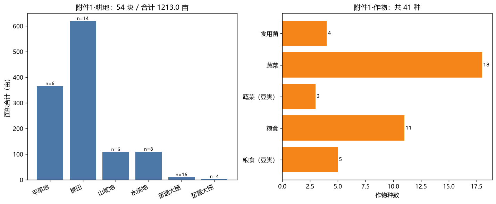
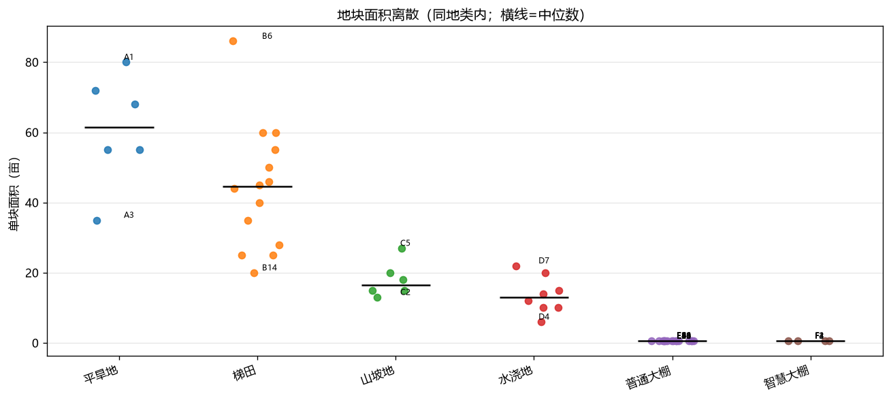
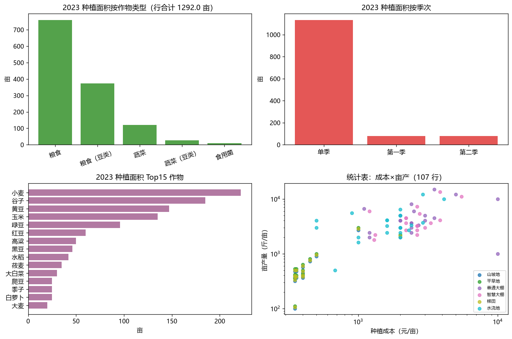
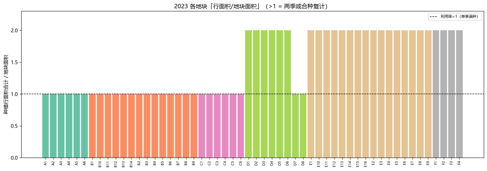
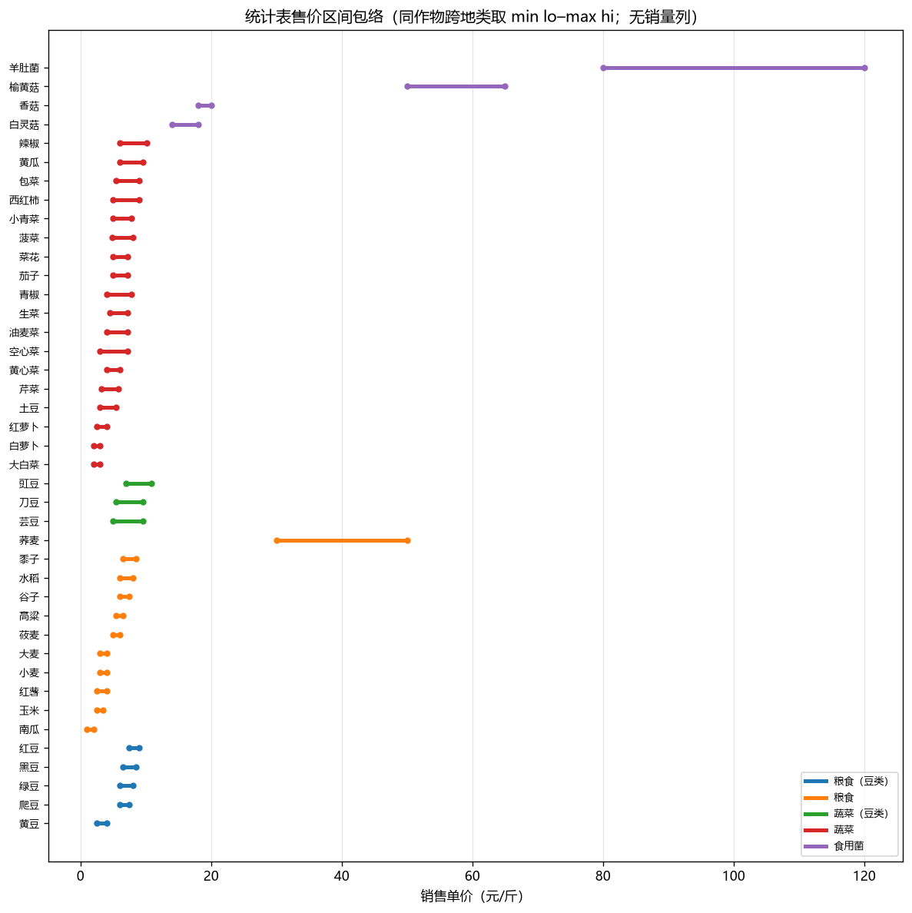
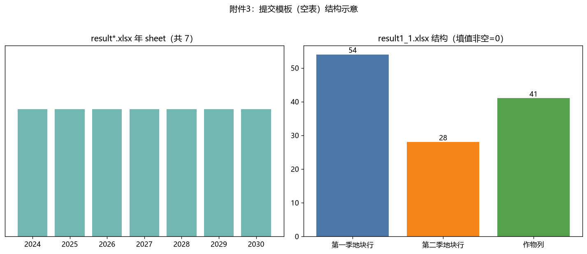
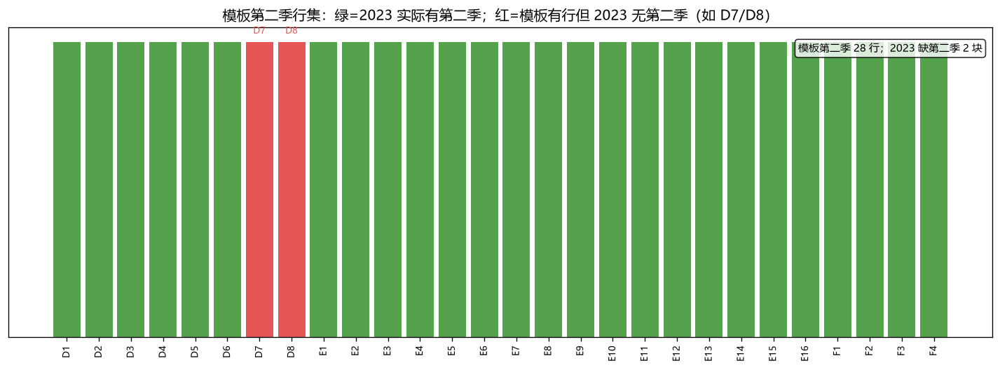
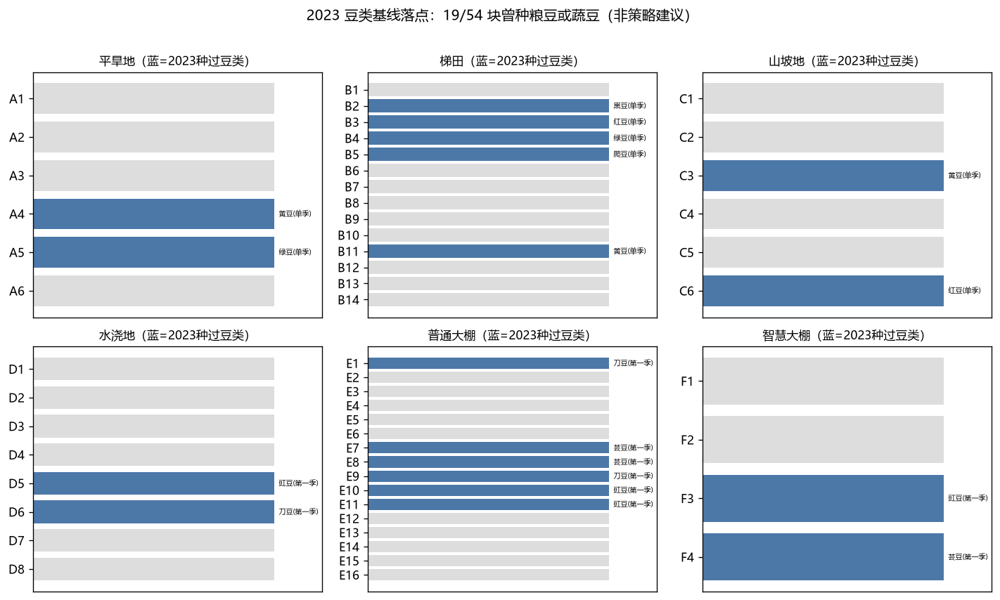

# 2024 年 CUMCM C 题（农作物的种植策略）数据画像

> 数据来源：`problems/cumcm24-c/source/`（只读，未改源文件）。  
> 读取：本仓 venv + openpyxl `read_only`/`data_only`；脚本 `eda/_make_overview.py` → `eda/_profile_stats.json`。  
> **声明：下文数字均来自这次真实读取**，不是题面抄录，也未对照任何优秀论文/参考答案。  
> **克制**：只写结构/量级/对齐/明显缺口；不写「该怎么种」「该用什么模型」。

## 0. 总体速览

| 附件 | sheet | 有效数据规模 | 时间/年份 | 要点 |
|---|---|---|---|---|
| 附件1 耕地 | `乡村的现有耕地` | **54 块**（露天 34 + 大棚 20） | 无时间列 | 露天合计 **1201.0 亩**；含大棚总面积 **1213.0 亩** |
| 附件1 作物 | `乡村种植的农作物` | **41 种**（编号 1–41） | 无时间列 | 类型：粮豆5 / 粮11 / 蔬豆3 / 蔬18 / 菌4；地类适宜多写在首行说明格 |
| 附件2 种植 | `2023年的农作物种植情况` | **87 行**（覆盖 54 块） | 2023 | 地块名有合并格→解析向前填充；行面积合计 **1292.0 亩**（两季复计） |
| 附件2 统计 | `2023年统计的相关数据` | **107 行** | 近年统计（表注） | 列：亩产/成本/售价区间；**无「预期销售量」列** |
| 附件3 模板 | `result1_1/1_2/result2.xlsx` | 各 7 个年 sheet（2024–2030） | 提交空表 | 结构一致；填值区非空单元格 **0** |

题面「露天 1201 亩 / 34 块」与附件1 露天合计一致；大棚 16+4=20 块、各 0.6 亩。

### 0.1 概览图

由 `eda/_make_overview.py` 生成（中文字体 Microsoft YaHei；含图说 §3 重绘轮）。路径相对 `problems/cumcm24-c/`。  
**为何这样画 / 呈现何特征 / 已知不足**：见 [`eda/图说.md`](eda/图说.md)。

| 图 | 路径 |
|---|---|
| 附件1 资源构成 | `eda/附件1.png` |
| 补·地块面积离散 | `eda/补-地块面积离散.png` |
| 附件2 2023 基线 | `eda/附件2.png` |
| 补·地块利用率 | `eda/补-地块利用率.png` |
| 补·售价区间 | `eda/补-售价区间.png` |
| 附件3 空模板结构 | `eda/附件3.png` |
| 补·模板季次覆盖 | `eda/补-模板季次覆盖.png` |
| 补·豆类落点 | `eda/补-豆类落点.png` |
| 外发拼图 | `eda/概览三合一.png`、`eda/概览补图.png` |

**附件1**（地类面积 + 作物类型种数）：

**补·地块面积离散**（同地类内单块面积）：

**附件2**（2023 种植面积分布 + 成本×亩产散点）：

**补·地块利用率**（行面积/地块面积；本数据恰为 1 或 2）：

**补·售价区间**（无销量列；包络 lo–hi）：

**附件3**（空提交模板结构）：

**补·模板季次覆盖**（第二季行 vs 2023；红=D7/D8）：

**补·豆类落点**（19/54 块曾种豆类）：

---

## 1. 附件1：耕地与作物（`附件1.xlsx`，17,147 字节）

### 1.1 耕地结构

- sheet：`乡村的现有耕地`；表头：`地块名称`、`地块类型`、`地块面积/亩`、`说明`。
- A1 的说明格含地类季次规则摘要（平旱/梯田/山坡单季；水浇可一或两季；大棚两季；智慧大棚冬调温）。

| 地块类型 | 块数 | 面积合计（亩） | 编号 |
|---|---:|---:|---|
| 平旱地 | 6 | 365.0 | A1–A6 |
| 梯田 | 14 | 619.0 | B1–B14 |
| 山坡地 | 6 | 108.0 | C1–C6 |
| 水浇地 | 8 | 109.0 | D1–D8 |
| 普通大棚 | 16 | 9.6 | E1–E16 |
| 智慧大棚 | 4 | 2.4 | F1–F4 |
| **露天小计** | **34** | **1201.0** | A–D |
| **全部** | **54** | **1213.0** | A–F |

### 1.2 作物结构

- sheet：`乡村种植的农作物`；表头：`作物编号`、`作物名称`、`作物类型`、`种植耕地`、`说明`。
- 有效作物行 **41**（编号连续 1–41）。`种植耕地` 仅少数行有字（如黄豆写平旱/梯田/山坡，水稻写水浇地，大白菜写水浇第二季，食用菌写普通大棚第二季）；多数为空白，规则集中在说明格与表末注。
- 表末注（季节窗口，原文）：水浇第一季约 3–6 月、第二季约 7–10 月；普通大棚第一季约 5–9 月、第二季约 9 月–翌年 4 月；智慧大棚第一季约 3–7 月、第二季约 8 月–翌年 2 月。

| 作物类型 | 种数 | 编号/名称（摘） |
|---|---:|---|
| 粮食（豆类） | 5 | 1–5 黄豆…爬豆 |
| 粮食 | 11 | 6–16 小麦…水稻 |
| 蔬菜（豆类） | 3 | 17–19 豇豆/刀豆/芸豆 |
| 蔬菜 | 18 | 20–37 土豆…红萝卜 |
| 食用菌 | 4 | 38–41 榆黄菇…羊肚菌 |

---

## 2. 附件2：2023 种植与统计（`附件2.xlsx`，21,976 字节）

### 2.1 种植情况

- sheet：`2023年的农作物种植情况`；表头：`种植地块`、`作物编号`、`作物名称`、`作物类型`、`种植面积/亩`、`种植季次`。
- **87 行**；`种植地块` 在两季续行常为空（Excel 合并/省略）→ 脚本向前填充后覆盖 **54** 个地块名。
- 季次行数：单季 28 / 第一季 29 / 第二季 30。
- 行面积合计 **1292.0 亩** > 地块总面积 1213：因水浇/大棚两季各记一行（复计）。
- 按作物类型的行面积（亩）：粮食 760.0、粮豆 374.0、蔬菜 121.6、蔬豆 26.8、食用菌 9.6。
- 2023 实际出现的作物编号 = 全表 1–41（每种至少一行）。
- 多行地块（两季或合种）：D1–D6、E1–E16、F1–F4（D7/D8 为水稻单季各 1 行）。
- 合种例：E15 第一季生菜 0.3 + 油麦菜 0.3；F 系列多见 0.3+0.3 半棚合种。

### 2.2 统计相关数据

- sheet：`2023年统计的相关数据`；表头：`序号`、`作物编号`、`作物名称`、`地块类型`、`种植季次`、`亩产量/斤`、`种植成本/(元/亩)`、`销售单价/(元/斤)`。
- **107 行**有效；地类分布：平旱/梯田/山坡各 15，水浇 22，普通大棚 22，智慧大棚 18。
- 亩产范围 **100–15000** 斤/亩；成本 **350–10000** 元/亩（大棚/菌类偏高，散点见图）。
- 销售单价多为区间字符串（如 `2.50-4.00`），共 **48** 种不同 raw 串；表中无单一标量价。
- **缺口（事实）**：本表**没有**「预期销售量 / 销量」列。题面 Q1 称相对 2023 稳定——销量口径需后续探索自推（例如由 2023 面积×亩产等），画像不预设公式。
- 表注：数据为近几年统计；智慧大棚第一季蔬菜参数与普通大棚相同、表中省略。

---

## 3. 附件3：提交模板（`result1_1.xlsx` / `result1_2.xlsx` / `result2.xlsx`）

三文件结构一致（核对：年 sheet、季次地块行数、作物列数均相同）：

| 项 | 值 |
|---|---|
| 年 sheet | 2024–2030（7 个） |
| 第一季地块行 | **54**（A1…F4 全覆盖） |
| 第二季地块行 | **28**（仅 D1–D8、E1–E16、F1–F4） |
| 作物列 | **41**（与附件1 作物名对齐；个别名后可能有尾随空格，如模板头「菠菜 」「生菜 」） |
| 填值区非空单元格 | **0**（空模板） |

表末有「不要对表格的形式作任何修改」类注（2024 sheet 可见）。Q1 填 `result1_1`/`result1_2`，Q2 填 `result2`；单元格含义为各地块×作物种植面积（亩），画像不解释最优准则。

---

## 4. 对齐与需留意的形态（非结论）

1. 地块集合：附件1 名称集 = 种植表填充后地块集 = 模板第一季行集。  
2. 作物集合：附件1 编号 1–41 = 2023 种植出现集 = 统计表作物集 = 模板列集（名称需 strip）。  
3. 露天面积 1201 与题面一致；总面积含大棚 1213。  
4. 统计表无销量列；售价为区间。  
5. 种植表依赖地块名向前填充；合种与两季导致行数 > 地块数。  
6. 模板第二季含 D7/D8，但 2023 这两块为水稻单季——模板行在、历史是否种第二季是探索问题。

## 5. 喂给后续探索的开放点（不问答案）

- 预期销售量如何从现有列构造？是否区分地类/季次？  
- 售价区间取中点、端点还是分布？  
- 「每种作物种植地不能太分散 / 单块面积不宜太小」在数据里有无显式阈值？  
- 豆类三年一次约束如何与 2023 现状衔接？  
- 合种（同行多作物）在模板里如何表达（多列同时非空）？

---

*生成：2026-09-06；重跑 `python problems/cumcm24-c/eda/_make_overview.py` 可刷新图与 `_profile_stats.json`。*
