<!-- 全流程分析 · 第 3 站 · 2026-08-28 -->

# 第 3 站：Beacon 内部多 agent 流水线（S9 LangGraph）

> **2026-09-04（D-029）**：本站价值仍成立。S9「降级」= 不默认无人值守全图，不是废弃 writer。本地编码 → frozen_asset → **写作段应接桥复用**。会话轨 B 是应急。

> 定位：S9 是可选执行器（D-005 降级为工具层），不挡交付。但它是「Beacon 内部多 agent 协作」的唯一载体，机制值得全解。

## 3.1 实际图结构（graph.py 源码核实，27 节点）

```mermaid
graph LR
    A[analyst] --> B[blueprint_critic]
    B -->|retry 重做蓝图| A
    B -->|advance| M[modeler]
    B -.->|stop 门禁停机| END([END])

    M --> D[modeler_derivation]
    D --> C[modeler_consistency]
    C --> MC[model_critic]
    MC -->|retry| M
    MC -->|advance 仅 basic/improved 阶段| AS[advance_stage 只推进阶段计数+重置迭代]
    AS --> M
    MC -->|to_coder 仅 final 阶段通过| CO[coder]
    MC -.->|stop| END

    CO --> CG[coder_generate]
    CG --> CE[coder_execute]
    CE --> MCC[model_code_consistency]
    MCC -->|retry_coder| CO
    MCC -->|advance| S[sensitivity]
    MCC -.->|stop| END

    S --> SG[sensitivity_code_generate]
    SG --> SE[sensitivity_code_execute]
    SE --> SI[sensitivity_interpret]
    SI --> FP[figure_pipeline]
    FP --> FC[figure_critic]
    FC --> FA[figure_analysis]
    FA -->|critic 循环| FC
    FA -->|done| W[writer]

    W --> WS[writer_section]
    WS -->|还有章节| WS
    WS -->|写完| PC[paper_critic]
    PC -->|retry| W
    PC -->|advance| TA[table_assembler]
    PC -.->|stop| END

    TA --> EV[evaluation]
    EV --> HR[human_review]
    HR -->|finalize| LX[latex]
    HR -.->|stop 拒绝| END
    LX --> FI[finalizer]
    FI --> END
```

**读图要点**：
- 实线 = 正常推进；**虚线 = stop（门禁停机，checkpoint 保留，可 recover/restart/resume）**；
- 回边 = retry（critic 不通过回生产节点）；
- 两个自循环：model_critic→advance_stage→modeler（basic→improved→final 三阶段）、writer_section→writer_section（分节写作，每节一 checkpoint）；
- figure 的 critic 环在 figure_pipeline/figure_critic/figure_analysis 三节点间。

## 3.2 核心机制

1. **critic 循环（review-iterate 对偶）**：每个生产节点（analyst/modeler/coder/writer/figure）后面跟 critic 节点——critic 不通过 → retry 回生产节点重做；通过 → advance。循环次数受门禁限制（如 MATH_AGENT_MAX_MODEL_ITERATIONS=3）。routing.py 的 after_X 函数返回 {retry/advance/stop} 键，LangGraph 条件边据此路由。
2. **stop = 门禁停机（不是失败终结）**：门禁耗尽/严重问题 → 停到 END，checkpoint 保留——可 `recover`（无注入续跑）/ `restart --from coder`（仅门禁停机态）/ 人审处 `resume --approve`。
3. **checkpoint（SQLite）**：每个节点完成存一个点（writer 每节一个）——崩溃恢复粒度=节点级/节级，`supervise` 自动续跑。
4. **complete() 统一 LLM 封装**：retry + 硬期限（attempt/total 超时）+ 结构化输出修复（JSON 修复/think 剥离/LaTeX 转义）。
5. **brief 注入六处**：analyst/blueprint_critic 全量、modeler 方向+公式、model_critic 公式+红线、coder 红线+公式、writer 讨论点分组（= 第 2 站查的注入矩阵的流水线侧）。
6. **frozen_asset（T-19/D-008）——两条路的桥**：`reference.json` 存在且 problem.json 哈希一致 → coder **跳过 LLM 生成**，注入确定性 wrapper 直接执行参考实现（零 LLM、600s 超时）。操作面 S5 验证过的脚本反过来喂给流水线。
7. **角色隔离**：primary/baseline/supporting 证据职责隔离（对照方案/主方案不混）。
8. **观察面**：`watch` / `progress.jsonl` / `insights/`（docs/03）。

## 3.3 为什么 S9 降级（D-005 背景）

- mcm51-c-refA 真跑：coder 成功（score 9/10）但下游 4 缺口——无人值守出好论文不可靠；
- 操作面（人/agent 分阶段驱动）才是主路径；S9 剩余价值 = 闸门/哈希/交棒/checkpoint 恢复的工具层；
- 与操作面评审分离（D-003）：流水线 `review`（人审接管）≠ `review-check`（S7 机械包装）。

## 3.4 与第 2 站（操作面）的接口

| 操作面 | 流水线 | 关系 |
|---|---|---|
| S5 参考实现（verify+recertify） | frozen_asset（coder 跳过 LLM） | S5 产物喂给 S9 |
| S6 paper 骨架（reference paper/expand） | writer 分节写作 | 两条产出路（轨 A/轨 B），D-020 后骨架→expand 为主 |
| S8 accept（acceptance.json） | human_review（checkpoint human_decision） | 双登记分离（D-004） |
| S7 review-check（机械闸） | 节点 critic（LLM 评审） | 两套评审不混用（D-003） |

## 讨论记录（2026-08-28 第七轮）

- Q1（review-iterate 对偶 = 强制外部视角防静默穿透）：确认。
- Q2（stop = 门禁停机留现场等介入，checkpoint 保留）：确认。
- Q3（frozen_asset = S5 验证成果喂给 S9，确定性桥接）：确认。
